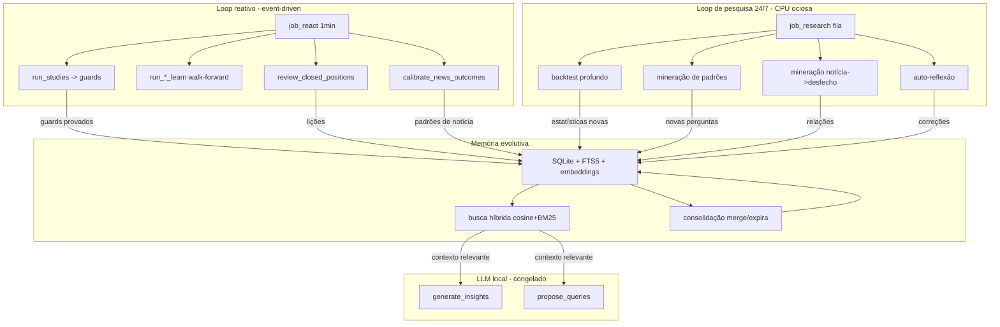

# Aprendizado contínuo + memória evolutiva

> Supercedido em escopo pelo plano **Desk USD autônomo evolutivo**
> (ledger → FDR → replay → memória → pesquisa isolada → gate de calibração).
> Este arquivo permanece como a fundamentação da memória externa.
>
> **Estado em 12/set/2026:** Fases 0–2 no código (ledger, Platt, régua de
> notícias 1/5/14d, whitelist FDR). Fases 3–7 implementadas em seguida:
> `hv_dip/replay.py`, `learn/memory.py` + `embedding.py`, `learn/research.py`
> em worker `arq:queue:research`, trava de calibração no `desk_gate`,
> bônus de notícia contínuo, pulse de assertividade, `scripts/deploy_windows.py`,
> ADB 35181. Benchmark do modelo pago: [benchmark-modelo-pago.md](benchmark-modelo-pago.md)
> (12/out/2026).

# Aprendizado contínuo + memória evolutiva (design original)

> Documento de planejamento (design + como aplicar + porquê). Aprovado em 2026-09-12.

## 1. O problema

O desk já aprende de forma **event-driven** (`job_react` reage a barra nova / trade fechado / notícia resolvida) e já usa o **LLM local** para estudar padrões históricos (insights fundamentados). Mas tem dois gargalos:

1. **Fica ocioso sem dado novo.** No fim de semana / fora da sessão, o mercado congela e o loop reativo não tem "combustível" — a CPU (que está folgada) fica parada.
2. **Não acumula.** Todo número é **recomputado** do zero a cada execução sobre o cache; a única coisa que acumula entre rodadas é a lista de perguntas propostas (`study_queries_extra.json`) e o fingerprint de mudança. Não existe "memória" de lições: uma descoberta de hoje não é consultável amanhã, exceto se virar um guard rígido.

O objetivo do usuário: **máquina de constante aprendizado e crescimento, capacidade de raciocínio crescente, sempre mais inteligente.**

## 2. O porquê (fundamentação)

A restrição real é de hardware: **CPU apenas, sem GPU**, rodando `qwen2.5:7b` via Ollama. Nesse cenário, **fine-tune de um 7B é inviável** (lento, caro em tempo, arriscado — risco de degradação/forget catastrófico sem GPU e sem pipeline de validação robusto).

A literatura atual (2026) sobre agentes que evoluem converge para o mesmo caminho alternativo:

- **Modelo congelado + memória externa que evolui.** A inteligência cresce no *contexto* (memória consultável), não nos *pesos*. É o padrão de RecMem, Recuris e DPA: o modelo base não muda; a memória acumula experiência curada e é injetada na hora do raciocínio.
- **Escrever pouco e bem.** Consolidação só quando há **recorrência**; dedup; detecção de conflito; expiração do que foi refutado por desfecho. Escrita sem LLM quando dá (chunks crus preservam mais sinal que resumo precoce).
- **Recuperação importa mais que escrita.** Busca **híbrida** (cosseno de embeddings + BM25/FTS5) vence embeddings sozinhos em recall. Rerank barato de um conjunto pequeno.

Consequência prática para o projeto: o "ficar mais inteligente" vem de **acumular lições reutilizáveis em SQLite + FTS5 + embeddings Ollama** e de **usar a CPU ociosa para pesquisa nova** (não para re-rodar o mesmo digest).

## 3. Arquitetura alvo

Dois loops, mantendo a invariante já existente no código:

- **Numérico (sem LLM)**: analogias, walk-forward, calibração — determinístico.
- **LLM (fundamentado, capped)**: classifica, propõe, revisa, gera insight. **Nunca calcula probabilidade**; só lê digest numérico pré-computado.

O loop de pesquisa novo é **local-only** (Ollama/CPU), nunca consome a cota Groq.

## 4. Como aplicar (fases, com debug ao final de cada)

### Fase 1 — Fundação: memória persistente

- **Novo** `backend/app/services/learn/__init__.py` + `memory.py`:
  - SQLite em `.cache/fiidesk/memory.db` (stdlib `sqlite3`), tabelas `memories` (kind ∈ `pattern|trade_review|news|guard|reflection`, scope `ticker|universe|channel`, `text` PT, `provenance`, `confidence`, `evidence` JSON, `ts`, `n_support`, `valid_until`), `memories_fts` (FTS5), `memory_emb` (memory_id, embedding, model, dims).
  - `add_memory()` com **gate de escrita conservador**: dedup semântica (cosseno > limiar), detecção de conflito, `n >= floor` quando estatístico.
  - `search(query, top_k)` com **busca híbrida** (cosseno + BM25/FTS5, fusão de scores).
- **Novo** `backend/app/services/learn/embedding.py`: `embed(texts)` via Ollama `/api/embed` (httpx). Pull de `nomic-embed-text` (upgrade futuro `bge-m3` para PT se necessário).
- **`backend/app/config.py`**: `learn_memory_path`, `learn_embedding_model`, `learn_memory_dedup_threshold`, `learn_research_enabled`, `learn_research_batch`.

**Debug**: `backend/tests/test_memory.py` (CRUD, dedup, conflito, rank da busca híbrida) + `test_embedding.py` (mock httpx) + smoke: `embed()` real e `add_memory`/`search` num corpus pequeno.

### Fase 2 — Coleta: os loops escrevem memória

- `studies/apply.py`: guard disparado ou padrão provado/refutado (`n >= 30`) → memória `pattern` (`p_target`, `n`, `channel:fingerprint`).
- `trade_review.py`: lição do trade fechado → memória `trade_review` (scope=ticker, provenance=position.id).
- `llm_calibrate.py`: padrão notícia→desfecho → memória `news`.
- `studies/runner.py`: insights gerados → memórias `pattern` reutilizáveis.
- **Novo** `backend/app/services/learn/harvest.py`: `harvest_pattern`, `harvest_trade_review`, `harvest_news` com write conservador.

**Debug**: `backend/tests/test_harvest.py` (cada loop escreve; dedup impede duplicata; só escreve com `n >= floor`) + rodar `job_react` e confirmar `memory.db` crescendo.

### Fase 3 — Consulta: o LLM raciocina com memória

- `studies/insight.py` `generate_insights`: `search()` das memórias relevantes ao digest e injetar no prompt.
- `studies/propose.py` `propose_queries`: recuperar o já provado para **não repropor** e **propor** o genuinamente novo.
- `trade_review.py`: lições de trades similares passados enriquecem a revisão.
- Busca híbrida + rerank barato (retrieval de precisão importa mais que escrita).

**Debug**: `backend/tests/test_insight.py`/`test_propose.py` com LLM mockado assertando que o prompt contém a memória injetada + smoke real mostrando insight que cita uma lição da memória.

### Fase 4 — Motor de pesquisa contínua (o "estudar o tempo inteiro")

- **Novo** `backend/app/services/learn/research.py`: fila persistente (SQLite `research_queue`) + runners:
  - `task_deep_backtest`: re-rodar `run_universe` com varredura de horizon (`5,10,20,40`) e métricas não usadas (`recovery`, `gap_hit`).
  - `task_pattern_mining`: `propose_queries` desencapado do piso 1x/dia quando ocioso (mantendo dedup + validação).
  - `task_news_mining`: cross-tab `NewsEvent.sentiment × raw.outcome_ret_1d` por setor/event_type/janela.
  - `task_reflect`: comparar previsões passadas com desfechos e escrever memórias corretivas.
- **`backend/app/workers/jobs.py`** `job_research` (uma tarefa por chamada, bounded, local-only) + **`arq_settings.py`** `cron(job_research, minute=_EVERY_MIN, unique=True)`.
- `job_research` **não** usa o `_react_lock` (cede ao loop reativo) e tem budget por tarefa; nunca escala para Groq.

**Debug**: `backend/tests/test_research.py` (fila persiste/resume; runners produzem saída válida; budget respeitado) + smoke `task_deep_backtest` real.

### Fase 5 — Consolidação: raciocínio que cresce

- `learn/memory.py` `consolidate()`: merge de memórias recorrentes, expira refutadas por desfecho, atualiza `confidence`/`n_support`.
- `jobs.py` `job_consolidate` (cron diário, ou dentro do `job_intelligence`).
- Métrica de crescimento: contagem de memórias, lições consolidadas, taxa de expiração.

**Debug**: `backend/tests/test_memory_consolidate.py` (merge, expiração, update de confiança) + smoke.

### Fase 6 — Reflexo no app + deploy

- `backend/app/schemas.py`: expor `learn` (contagem de memórias, pesquisa recente, nível de crescimento) no pulse.
- `app/lib/data/models/intelligence_pulse.dart` + `studies_page.dart` / `intelligence_panels.dart`: mostrar a inteligência acumulada (auto-refresh 60s já existente).
- Deploy: `pytest` completo verde; reiniciar `fiidesk-worker` + `fiidesk-api`; rebuild APK (instalar no M55 via adb) + rebuild Windows (agente) e relançar.

**Debug**: `flutter analyze` + widget tests; journal `job_research`/`consolidate` rodando e memória crescendo; pulse com `learn` populado.

## 5. Decisões assumidas

- **Memória, não fine-tune** (escolha confirmada pelo usuário): modelo congelado + memória externa evolutiva.
- **Escopo por fases** (confirmado): começa pela experiência própria do desk; conhecimento de mercado externo (notícias/earnings/macro) entra como fase futura.
- **Armazenamento leve**: SQLite stdlib + FTS5 + embeddings Ollama + cosseno em Python. Sem vetor-DB (escala de centenas/milhares de memórias, vetor-DB seria overkill e nova dependência).
- **Pesquisa local-only**: nunca consome cota Groq; roda na CPU ociosa com budget por tarefa para não estrelar o loop reativo.

## 6. Arquivos-chave

**Novos**: `backend/app/services/learn/` (`__init__.py`, `memory.py`, `embedding.py`, `harvest.py`, `research.py`)

**Modificados**: `backend/app/services/llm_client.py`, `studies/apply.py`, `studies/insight.py`, `studies/propose.py`, `studies/runner.py`, `llm_calibrate.py`, `trade_review.py`, `workers/jobs.py`, `workers/arq_settings.py`, `config.py`, `schemas.py`

**App**: `app/lib/data/models/intelligence_pulse.dart`, `app/lib/features/intelligence/studies_page.dart`, `intelligence_panels.dart`

**Testes**: `backend/tests/test_memory.py`, `test_embedding.py`, `test_harvest.py`, `test_research.py`, `test_memory_consolidate.py` + widgets no app

## 7. Observação sobre o Context7

Na data de escrita, o MCP Context7 hospedado (`mcp.context7.com/mcp`) reportou cota compartilhada esgotada — a chave pessoal do usuário (60/1000) não estava sendo usada pelo endpoint anônimo do plugin. A fundamentação acima veio de pesquisa web atual (literatura 2026 de memória/evolução de agentes). Pendência opcional: reconfigurar o MCP com `CONTEXT7_API_KEY` pessoal e revalidar com docs oficiais.
