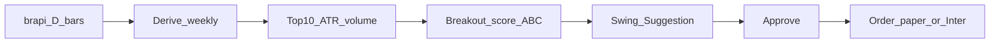

# Swing Desk MVP (brapi D+W)

## Suas dúvidas (decisão)

### Quantas vezes/dia no free (~15k/mês, você em 2/15k)

Orçamento útil com folga de 20%: **~12.000 req/mês**.

Com **30 tickers** e **1 request por ticker** por refresh (histórico **diário**; tendência **semanal derivada** das barras diárias — economiza request):

- Custo por refresh completo: **~30 req**
- Máximo teórico: 12.000 ÷ 30 ≈ **400 refreshes/mês** ≈ **13–18× por dia** (conforme use todos os dias ou só pregão)

**Aproveitamento máximo útil para swing (não day trade):**

| Ritmo | Req/dia (30 tickers) | Req/mês (~22 pregões) |
|-------|----------------------|-------------------------|
| 1× (fechamento) | 30 | ~660 |
| **4× (abertura, meio, final, EOD)** | 120 | ~2.600 |
| 6× no pregão | 180 | ~4.000 |

**Recomendação de produto:** worker swing **4× ao dia** em dias úteis (ou cron fixo). Sobra >50% da cota free. Não precisa rodar a cada 5 min.

### Precisa de serviço pago? Dá para fazer “por conta própria”?

- **Para o MVP / primeiros meses: não precisa pago.** Free basta com o ritmo acima.
- **“Desenvolver por conta própria”** no sentido de OHLC B3 confiável: a B3 **não** oferece API retail aberta de histórico; o que existe é B2B/institucional ou **scraping** (Yahoo/HTML) — frágil, ToS, quebra fácil, ruim para worker 24/7.
- **brapi free já é o caminho caseiro racional:** você não reinventa o coletor; só consome REST.
- Pago (Startup) só se: estourar cota, precisar histórico longo (anos), batch de tickers, delay menor, ou **1h em alta frequência**.

**Fechado:** D+W reais via brapi free agora; **1h na sprint seguinte**; key já existe (só `BRAPI_TOKEN` no `.env` — não colar a key no chat).

## Playbook travado no código

- Filtro: tendência semanal a favor (ex. close > SMA20 semanal, SMA derivada do diário)
- Entrada: rompimento diário na direção do semanal
- Score Opção 1: A / B / C com risco 1–1,5% / 0,5–1% / paper
- Freios: máx. **5** posições; piso caixa **20%**; sem limite semanal além do teto
- Universo: lista fixa ~30 (Agent monta: BDRs tech líquidos + IVVB11 + poucos não-tech líquidos)
- Toggle **Income | Swing** no mesmo app
- Paper default; ordens reutilizam adapters fase 3

## Implementação (repo atual)

Espelhar padrões de [backend/app/domain/models.py](/home/<USER>/Projects/fiidesk/backend/app/domain/models.py), worker e Flutter.

1. **Config:** `brapi_token`, `swing_universe` path ou constante, `swing_refresh_cron` / intervalo longo (ex. 4 slots/dia, não 300s cegos para 30 tickers).
2. **Domain:** `strategy_kind` em Suggestion/Order (`income`|`swing`); campos swing (entry, stop, target, score_letter, r_multiple); regras swing na conta (max_positions=5, cash_floor_pct=20, risk_pct_a/b).
3. **Migration 004.**
4. **`services/brapi_client.py`** + **`services/swing/`**: ingest D, derive W, ATR%, volume vs SMA20, breakout detect, score A/B/C, Top 10, cria suggestions `kind=swing`.
5. **Worker:** ciclo FII existente + ciclo swing respeitando cota (cache local OHLC; só refetch se stale).
6. **API:** listar/aprovar swing; freios ao criar ordem (posições abertas, caixa).
7. **Flutter:** switch Income|Swing; telas irmãs (sugestões com entry/stop/alvo/score); settings swing.
8. **Docs:** playbook 1 página + README brapi free 4×/dia.

## Fora deste MVP

Barras 1h; Avenue/US direto; lista automática mensal; plano brapi pago.
